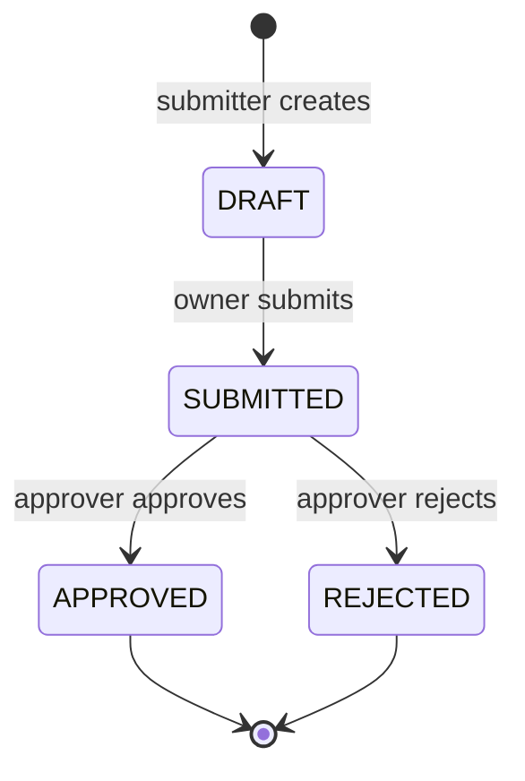

# Claims Approval API

[](https://github.com/Pallavi-Nile-98/claims-approval-api/actions/workflows/ci.yml)

A small but complete insurance-claims service: submitters create claims, approvers review
them, and every claim follows a strict lifecycle, `DRAFT -> SUBMITTED -> APPROVED | REJECTED`,
where invalid transitions are rejected with a clear error. Built with **Java 21 / Spring Boot 3**
and **PostgreSQL**, with a lightweight web UI, deployed to **AWS** (ECS Fargate, RDS, Application
Load Balancer) with **Terraform**, then deliberately broken five ways to practise production
troubleshooting.

**61 automated tests** · **39 AWS resources in Terraform** · **about $0.07/hour while running** ·
**5 production-style failures diagnosed and documented**

- [Architecture](#architecture): how the pieces fit together on AWS
- [Design decisions](#design-decisions): private database, no NAT gateway, Fargate, and what each trade-off costs
- [Break-fix runbook](docs/RUNBOOK.md): five induced failures, each as symptom -> diagnosis -> root cause -> fix -> prevention

> Work in progress. Sections below are filled in as each phase lands.

## Run locally

Requires Java 21 and Docker.

```bash
cp .env.example .env          # then set real passwords in .env
docker compose up -d          # starts PostgreSQL on localhost:5434
./mvnw spring-boot:run        # on Windows: mvnw.cmd spring-boot:run
curl http://localhost:8080/actuator/health
```

## Architecture


How a request flows:

1. The **ALB** receives HTTP on port 80 and forwards it to the task on port 8080. Its health check
   calls `/actuator/health`, and ECS replaces any task the ALB marks unhealthy.
2. The **Fargate task** runs in a public subnet with a public IP, but its security group accepts
   traffic **only from the ALB's security group**, so nothing on the internet can reach it directly
   (see [no NAT gateway](#2-no-nat-gateway-tasks-in-public-subnets-locked-to-the-load-balancer)).
3. The app talks to **RDS** on port 5432. The database sits in private subnets with **no route to or
   from the internet**, and its security group accepts only the app's security group.
4. Before the container starts, ECS uses the **execution role** to pull the image from ECR and read
   the database password from SSM; the dotted lines go out through the internet gateway, because
   there is no NAT gateway.

**Claim lifecycle**, enforced in the service layer and rechecked by a database `CHECK` constraint:



An approver can never review a claim they submitted (separation of duties), and two people acting on
the same claim at once are caught by optimistic locking (409).

**Code layout** (`src/main/java/io/github/pallavinile98/claims`):

| Package | Responsibility |
|---|---|
| `controller` | HTTP only: maps requests to service calls; reads the caller's identity from headers |
| `service` | All business rules: state transitions, roles, ownership, separation of duties |
| `domain` | The `Claim` entity and the `ClaimStatus` state machine |
| `repository` | Spring Data JPA queries |
| `dto` | Request/response shapes, kept separate from the entity |
| `exception` | Domain exceptions and the global RFC 9457 error handler |

The web UI is plain HTML, CSS and JavaScript in `src/main/resources/static`, served by the same app.

## API

Interactive docs: **Swagger UI** at `http://localhost:8080/swagger-ui.html`
(OpenAPI JSON at `/v3/api-docs`).

| Method | Path | Who | Result |
|---|---|---|---|
| `POST` | `/api/claims` | SUBMITTER | 201, claim in `DRAFT`, `Location` header |
| `GET` | `/api/claims/{id}` | APPROVER, or the owning SUBMITTER | 200 |
| `GET` | `/api/claims?status=&page=0&size=20` | APPROVER sees all, SUBMITTER sees own | 200, newest first, `size` max 100 |
| `POST` | `/api/claims/{id}/submit` | owning SUBMITTER | `DRAFT -> SUBMITTED` |
| `POST` | `/api/claims/{id}/approve` | APPROVER (not the submitter) | `SUBMITTED -> APPROVED` |
| `POST` | `/api/claims/{id}/reject` | APPROVER (not the submitter) | `SUBMITTED -> REJECTED` |

### Identity (demo only)

Every request carries two headers:

```
X-User-Id: alice
X-User-Role: SUBMITTER | APPROVER
```

> **Real authentication is out of scope.** Anyone can send any header, so this
> must never face real users as-is. All header parsing lives in one class
> (`CurrentUserArgumentResolver`); swapping it for JWT/OIDC validation (e.g.
> Amazon Cognito) would leave the controllers and business rules unchanged.

### Errors

All errors use [RFC 9457 Problem Details](https://www.rfc-editor.org/rfc/rfc9457):

```json
{
  "type": "about:blank",
  "title": "Invalid state transition",
  "status": 409,
  "detail": "Claim 1 cannot move from DRAFT to APPROVED; allowed next states: [SUBMITTED]",
  "instance": "/api/claims/1/approve"
}
```

| Status | When |
|---|---|
| 400 | Invalid body or parameters (with a per-field `errors` list), malformed JSON, missing/invalid identity headers |
| 403 | Wrong role, someone else's claim, or an approver reviewing their own claim |
| 404 | Claim does not exist |
| 409 | Illegal status transition, or a concurrent update (optimistic locking via a `version` column) |

### Example

```bash
curl -X POST localhost:8080/api/claims \
  -H "X-User-Id: alice" -H "X-User-Role: SUBMITTER" -H "Content-Type: application/json" \
  -d '{"title":"Taxi to client site","amount":42.50}'
curl -X POST localhost:8080/api/claims/1/submit  -H "X-User-Id: alice" -H "X-User-Role: SUBMITTER"
curl -X POST localhost:8080/api/claims/1/approve -H "X-User-Id: bob"   -H "X-User-Role: APPROVER"
```

## Tests

**61 automated tests**: 41 unit + 20 integration, run by GitHub Actions on every push
and pull request.

| Kind | Command | Needs Docker | What it covers |
|---|---|---|---|
| Unit (`*Test`, Surefire) | `./mvnw test` | No | The full 4x4 status transition table (all 16 from/to pairs); every service action from every starting status; role, ownership and self-approval rules (Mockito, no Spring) |
| Integration (`*IT`, Failsafe) | `./mvnw verify` | Yes | The HTTP API end to end against **real PostgreSQL 16** via Testcontainers: happy paths, pagination and filtering, every 400/403/404/409 case, optimistic locking, the database `CHECK` constraint, `/actuator/health`, and that the web UI is packaged and served |

`./mvnw verify` runs both. Integration tests use a real database rather than H2
because H2 only imitates Postgres: constraint and timestamp behaviour can differ, so a
passing H2 test would prove less.

## Deploy to AWS

Infrastructure is Terraform (`terraform/`); deployment is a handful of Bash scripts
(`scripts/`, run with Git Bash on Windows). Requires Docker, the AWS CLI configured
with an **IAM user** (the scripts refuse root credentials), and Terraform >= 1.11.

| Command | What it does |
|---|---|
| `bash scripts/deploy.sh` | Build the image tagged with the git commit SHA, push it to ECR, `terraform apply`, wait for ECS to be stable, confirm no rollback happened, then run the smoke test |
| `bash scripts/verify.sh [url]` | HTTP smoke test: health, full claim lifecycle, 409/400/404 cases. Defaults to the ALB URL |
| `bash scripts/destroy.sh` | `terraform destroy`, then check that nothing billable is left |
| `bash scripts/check-leftovers.sh` | Only the leftover check |
| `bash scripts/build.sh` / `push.sh` | The individual build and push steps |

Every `apply` and `destroy` shows the Terraform plan and waits for you to type `yes`;
nothing is auto-approved. `build.sh` refuses to run with uncommitted changes, so an
image tag always matches a commit.

The first deploy creates only the ECR repository, pushes the image, then creates the
rest. This ordering is needed because the ECS service needs an image before it can start.

**Cost:** about $0.07/hour (~$53/month if left running), mostly the load balancer, RDS
and public IPv4 addresses. **Run `destroy.sh` after every session.**

## Design decisions

_TODO (Phase 6)_
