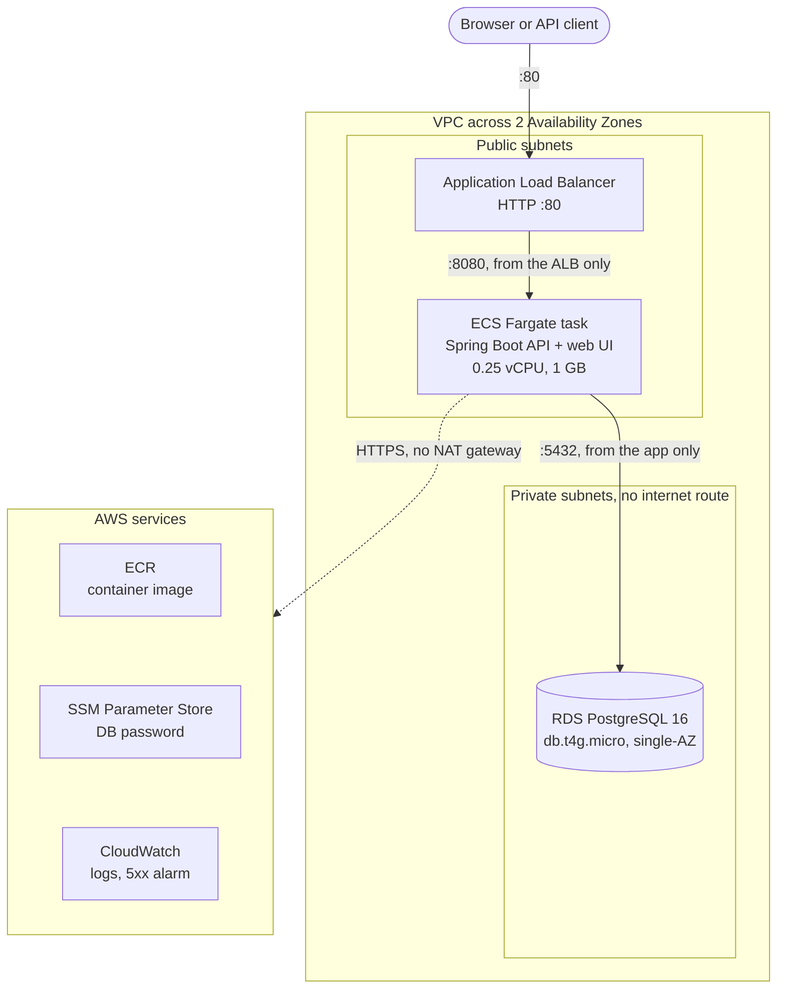
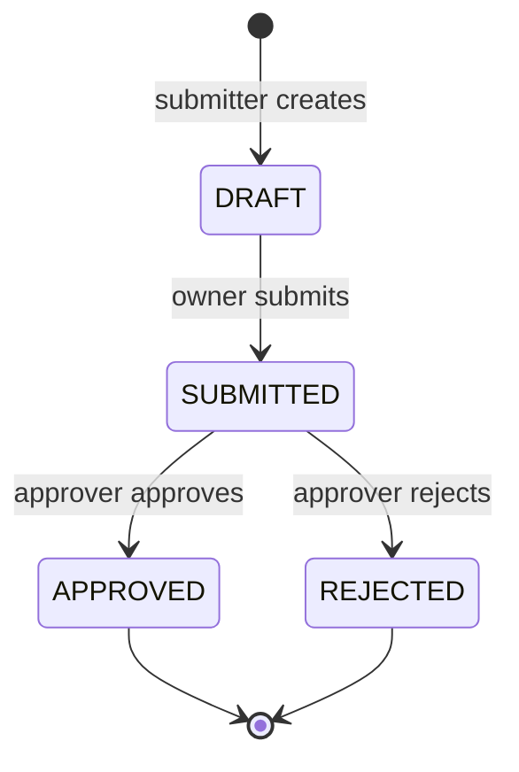

# Claims Approval API

[](https://github.com/Pallavi-Nile-98/claims-approval-api/actions/workflows/ci.yml)

A small but complete insurance-claims service: submitters create claims, approvers review
them, and every claim follows a strict lifecycle, `DRAFT -> SUBMITTED -> APPROVED | REJECTED`,
where invalid transitions are rejected with a clear error. Built with **Java 21 / Spring Boot 3**
and **PostgreSQL**, with a lightweight web UI, deployed to **AWS** (ECS Fargate, RDS, Application
Load Balancer) with **Terraform**, then deliberately broken five ways to practise production
troubleshooting.

**61 automated tests** · **39 AWS resources in Terraform** · **about $0.07/hour while running** ·
**5 production-style failures diagnosed and documented**

- [Architecture](#architecture): how the pieces fit together on AWS
- [Design decisions](#design-decisions): private database, no NAT gateway, Fargate, and what each trade-off costs
- [Break-fix runbook](docs/RUNBOOK.md): five induced failures, each as symptom -> diagnosis -> root cause -> fix -> prevention

> Work in progress. Sections below are filled in as each phase lands.

## Run locally

Requires Java 21 and Docker.

```bash
cp .env.example .env          # then set real passwords in .env
docker compose up -d          # starts PostgreSQL on localhost:5434
./mvnw spring-boot:run        # on Windows: mvnw.cmd spring-boot:run
curl http://localhost:8080/actuator/health
```

## Architecture



How a request flows:

1. The **ALB** receives HTTP on port 80 and forwards it to the task on port 8080. Its health check
   calls `/actuator/health`, and ECS replaces any task the ALB marks unhealthy.
2. The **Fargate task** runs in a public subnet with a public IP, but its security group accepts
   traffic **only from the ALB's security group**, so nothing on the internet can reach it directly
   (see [no NAT gateway](#2-no-nat-gateway-tasks-in-public-subnets-locked-to-the-load-balancer)).
3. The app talks to **RDS** on port 5432. The database sits in private subnets with **no route to or
   from the internet**, and its security group accepts only the app's security group.
4. Before the container starts, ECS uses the **execution role** to pull the image from ECR and read
   the database password from SSM; the dotted lines go out through the internet gateway, because
   there is no NAT gateway.

**Claim lifecycle**, enforced in the service layer and rechecked by a database `CHECK` constraint:



An approver can never review a claim they submitted (separation of duties), and two people acting on
the same claim at once are caught by optimistic locking (409).

**Code layout** (`src/main/java/io/github/pallavinile98/claims`):

| Package | Responsibility |
|---|---|
| `controller` | HTTP only: maps requests to service calls; reads the caller's identity from headers |
| `service` | All business rules: state transitions, roles, ownership, separation of duties |
| `domain` | The `Claim` entity and the `ClaimStatus` state machine |
| `repository` | Spring Data JPA queries |
| `dto` | Request/response shapes, kept separate from the entity |
| `exception` | Domain exceptions and the global RFC 9457 error handler |

The web UI is plain HTML, CSS and JavaScript in `src/main/resources/static`, served by the same app.

## API

Interactive docs: **Swagger UI** at `http://localhost:8080/swagger-ui.html`
(OpenAPI JSON at `/v3/api-docs`).

| Method | Path | Who | Result |
|---|---|---|---|
| `POST` | `/api/claims` | SUBMITTER | 201, claim in `DRAFT`, `Location` header |
| `GET` | `/api/claims/{id}` | APPROVER, or the owning SUBMITTER | 200 |
| `GET` | `/api/claims?status=&page=0&size=20` | APPROVER sees all, SUBMITTER sees own | 200, newest first, `size` max 100 |
| `POST` | `/api/claims/{id}/submit` | owning SUBMITTER | `DRAFT -> SUBMITTED` |
| `POST` | `/api/claims/{id}/approve` | APPROVER (not the submitter) | `SUBMITTED -> APPROVED` |
| `POST` | `/api/claims/{id}/reject` | APPROVER (not the submitter) | `SUBMITTED -> REJECTED` |

### Identity (demo only)

Every request carries two headers:

```
X-User-Id: alice
X-User-Role: SUBMITTER | APPROVER
```

> **Real authentication is out of scope.** Anyone can send any header, so this
> must never face real users as-is. All header parsing lives in one class
> (`CurrentUserArgumentResolver`); swapping it for JWT/OIDC validation (e.g.
> Amazon Cognito) would leave the controllers and business rules unchanged.

### Errors

All errors use [RFC 9457 Problem Details](https://www.rfc-editor.org/rfc/rfc9457):

```json
{
  "type": "about:blank",
  "title": "Invalid state transition",
  "status": 409,
  "detail": "Claim 1 cannot move from DRAFT to APPROVED; allowed next states: [SUBMITTED]",
  "instance": "/api/claims/1/approve"
}
```

| Status | When |
|---|---|
| 400 | Invalid body or parameters (with a per-field `errors` list), malformed JSON, missing/invalid identity headers |
| 403 | Wrong role, someone else's claim, or an approver reviewing their own claim |
| 404 | Claim does not exist |
| 409 | Illegal status transition, or a concurrent update (optimistic locking via a `version` column) |

### Example

```bash
curl -X POST localhost:8080/api/claims \
  -H "X-User-Id: alice" -H "X-User-Role: SUBMITTER" -H "Content-Type: application/json" \
  -d '{"title":"Taxi to client site","amount":42.50}'
curl -X POST localhost:8080/api/claims/1/submit  -H "X-User-Id: alice" -H "X-User-Role: SUBMITTER"
curl -X POST localhost:8080/api/claims/1/approve -H "X-User-Id: bob"   -H "X-User-Role: APPROVER"
```

## Tests

**61 automated tests**: 41 unit + 20 integration, run by GitHub Actions on every push
and pull request.

| Kind | Command | Needs Docker | What it covers |
|---|---|---|---|
| Unit (`*Test`, Surefire) | `./mvnw test` | No | The full 4x4 status transition table (all 16 from/to pairs); every service action from every starting status; role, ownership and self-approval rules (Mockito, no Spring) |
| Integration (`*IT`, Failsafe) | `./mvnw verify` | Yes | The HTTP API end to end against **real PostgreSQL 16** via Testcontainers: happy paths, pagination and filtering, every 400/403/404/409 case, optimistic locking, the database `CHECK` constraint, `/actuator/health`, and that the web UI is packaged and served |

`./mvnw verify` runs both. Integration tests use a real database rather than H2
because H2 only imitates Postgres: constraint and timestamp behaviour can differ, so a
passing H2 test would prove less.

## Deploy to AWS

Infrastructure is Terraform (`terraform/`); deployment is a handful of Bash scripts
(`scripts/`, run with Git Bash on Windows). Requires Docker, the AWS CLI configured
with an **IAM user** (the scripts refuse root credentials), and Terraform >= 1.11.

| Command | What it does |
|---|---|
| `bash scripts/deploy.sh` | Build the image tagged with the git commit SHA, push it to ECR, `terraform apply`, wait for ECS to be stable, confirm no rollback happened, then run the smoke test |
| `bash scripts/verify.sh [url]` | HTTP smoke test: health, full claim lifecycle, 409/400/404 cases. Defaults to the ALB URL |
| `bash scripts/destroy.sh` | `terraform destroy`, then check that nothing billable is left |
| `bash scripts/check-leftovers.sh` | Only the leftover check |
| `bash scripts/build.sh` / `push.sh` | The individual build and push steps |

Every `apply` and `destroy` shows the Terraform plan and waits for you to type `yes`;
nothing is auto-approved. `build.sh` refuses to run with uncommitted changes, so an
image tag always matches a commit.

The first deploy creates only the ECR repository, pushes the image, then creates the
rest. This ordering is needed because the ECS service needs an image before it can start.

**Cost:** about $0.07/hour (~$53/month if left running), mostly the load balancer, RDS
and public IPv4 addresses. **Run `destroy.sh` after every session.**

## Design decisions

Each decision states what was chosen, why, and what it costs. The
[AWS Well-Architected mapping](#aws-well-architected-mapping) below summarises them by pillar.

### 1. The database is private: no public endpoint, no internet route

**Decision:** RDS runs with `publicly_accessible = false` in private subnets whose route table has
no `0.0.0.0/0` route, and its security group accepts port 5432 only from the app's security group.

**Why:** defence in depth. Even a mistaken security group rule can't expose the database to the
internet, because there is no route to it. The only client is the application.

**Trade-off:** I can't connect to the database from my laptop. Debugging needs a tunnel (e.g. an SSM
port-forwarding session through a host in the VPC) or access through the app. That's acceptable when
the app is the only client.

### 2. No NAT gateway: tasks in public subnets, locked to the load balancer

**Decision:** the Fargate task runs in a public subnet with a public IP, so it can reach ECR, SSM and
CloudWatch Logs through the internet gateway. Its security group's only inbound rule allows port
8080 **from the ALB's security group**, so nothing on the internet can open a connection to it. You can test
this: `curl http://<task-public-ip>:8080` times out.

**Why:** cost. This is a personal account, and a NAT gateway would be the single most expensive
resource here.

| | **This project**: public subnet + public IP | Private subnets + NAT gateway | Private subnets + VPC endpoints |
|---|---|---|---|
| Monthly cost (us-east-2) | ~$3.65 per task (public IPv4) | ~$33 per NAT gateway + $0.045/GB; ~$66 with one per AZ for high availability | ~$7.30 per endpoint per AZ; the task needs 4 (ecr.api, ecr.dkr, logs, ssm), so ~$29-58 |
| Can the internet reach the task? | No: the security group admits only the ALB | No: no public IP | No: no public IP |
| Outbound traffic | Anywhere on 443, plus RDS on 5432 | Anywhere, through the NAT (can be filtered) | Only the listed AWS services (strongest) |
| When I'd choose it | Demos, low-risk or cost-sensitive workloads | The usual production default | Regulated or internet-free workloads |

**Trade-off:** security depends on one security group rule instead of on having no public address
at all. If someone opened the app's security group to `0.0.0.0/0`, the task would be directly
reachable. Mitigations: the rule is managed by Terraform, `terraform plan` detects manual changes
(see [runbook failure 1](docs/RUNBOOK.md)), and outbound traffic is limited to ports 443 and 5432.

### 3. ECS Fargate instead of EC2

**Decision:** run the container on Fargate (serverless containers) rather than on EC2 instances in an
ECS cluster.

**Why:** there are no servers to patch, scale or secure; AWS manages the host OS and the ECS agent. A
single small service fits Fargate well, and deploys are just a new task definition revision.

**Trade-off:** per vCPU, Fargate costs more than EC2 at steady load, and it has fewer knobs (no
SSH to the host, no swap, fixed CPU/memory combinations). Here the difference is small: about
$14/month for the task and its public IP, against about $10/month for a t4g.micro instance with its
disk and public IP. That instance would also need AMI updates and capacity management.

### 4. Header-based roles instead of real authentication (demo only)

**Decision:** the caller's identity comes from two request headers, `X-User-Id` and `X-User-Role`.

**Why:** authentication was explicitly out of scope, and the project's focus is the workflow and the
infrastructure. All header parsing is isolated in one class (`CurrentUserArgumentResolver`), so the
controllers and business rules don't depend on how identity is established.

**Trade-off:** anyone can claim to be anyone, so this must never face real users. In production
I'd use Amazon Cognito (OIDC): either the ALB authenticates users before requests reach the app, or
Spring Security validates JWTs. Only that one resolver would change.

### 5. Secrets never in code or in Terraform state

**Decision:** Terraform generates the database password as an *ephemeral* value (never written to
state) and passes it to RDS and to an SSM Parameter Store `SecureString` through *write-only*
arguments. ECS injects it into the container at start-up as `DB_PASSWORD`.

**Why:** the password appears nowhere in the repository, the plan output, `terraform.tfstate` or
the task definition. SSM standard parameters are free; Secrets Manager would add automatic rotation
for $0.40/month, which this project doesn't need.

**Trade-off:** no automatic rotation. To rotate, bump the write-only version in Terraform and
redeploy so new tasks read the new value.

### 6. Least-privilege IAM: separate execution and task roles

**Decision:** two roles with different jobs:

- **Execution role** (used by ECS *before* the app starts): pull this one image repository, write to
  this one log group, read this one SSM parameter.
- **Task role** (used by the app *while it runs*): only ECS Exec, for debugging shells. The app calls
  no AWS APIs.

Both roles trust only `ecs-tasks.amazonaws.com` from this account (an `aws:SourceAccount` condition
against the confused-deputy problem). Apart from a `log-stream:*` pattern inside the one log group
(ECS names a new stream per task), there are exactly two wildcards, both documented in `iam.tf`
because AWS doesn't support resource-level permissions for those actions:
`ecr:GetAuthorizationToken` and the `ssmmessages` channel actions used by ECS Exec.

**Why:** a compromised container can't read other secrets, pull other images or write elsewhere.
[Runbook failure 2](docs/RUNBOOK.md) shows the boundary in practice: removing one permission from the
execution role stops tasks from starting, while the task role is not involved.

### 7. Reliability within a budget: one task, single-AZ database

**Decision:** one Fargate task and a single-AZ `db.t4g.micro` instance.

**Why:** cost. Multi-AZ RDS doubles the database cost, and a second task adds about $14/month
(the task plus its public IP).

**What still protects the service:** ALB health checks with automatic task replacement; rolling
deploys that keep the old task serving until the new one is healthy (`minimum healthy percent =
100`); the deployment circuit breaker with automatic rollback (it rolled back three bad deploys
without users noticing, see the [runbook](docs/RUNBOOK.md)); database constraints; optimistic
locking; and versioned Flyway migrations.

**Trade-off:** an Availability Zone outage or database maintenance means downtime, and the one task
is a single point of failure. Production would use Multi-AZ RDS, at least two tasks spread across
AZs, longer backup retention and deletion protection.

### 8. Everything as code, with scripted and checked deploys

**Decision:** all 39 AWS resources are defined in Terraform. `scripts/deploy.sh` builds an image
tagged with the git commit, pushes it, shows the Terraform plan for manual approval, waits for ECS
and for a healthy load balancer target, **checks that ECS did not silently roll back**, and runs
an HTTP smoke test. `scripts/destroy.sh` removes everything and confirms nothing billable is left.

**Why:** the environment can be rebuilt identically in about 15 minutes, so it can be destroyed
after every session. Manual console changes show up as drift in `terraform plan`, which pinpointed
three of the five runbook failures in one line each.

**Trade-off:** Terraform state is local (one person, one environment). A team would use an S3
backend with encryption, versioning and locking, and run plan/apply from CI.

### 9. Observability: logs and one alarm, and what the runbook showed was missing

**Decision:** application logs go to CloudWatch Logs (7-day retention). One alarm fires on 5 or more
5xx responses in 5 minutes, counting both the ALB's own errors and the app's, and notifies by email
through SNS.

**Why:** that one alarm covers the outage users would notice.

**Trade-off, learned the hard way:** of the five induced failures, the 5xx alarm caught only one.
Rollbacks, the ALB failing open, and connection tracking hid the others from users and from
the alarm, including a task-replacement loop that ran unnoticed for two days. Production would add
alarms on `UnHealthyHostCount`, failed ECS deployments and out-of-memory task stops.

## AWS Well-Architected mapping

| Pillar | What this project does | Known gaps (deliberate) |
|---|---|---|
| **Operational excellence** | Everything in Terraform; scripted deploys with plan approval, rollback detection and a smoke test; CI on every push; a runbook of five rehearsed failures | One alarm; no deployment pipeline (deploys run from a laptop) |
| **Security** | Private database with no route; security groups chained by reference; least-privilege roles with two justified wildcards; secret kept out of code, state and task definition; encrypted storage; non-root container; input validation; XSS-safe UI | Header identity instead of real authentication; HTTP, not HTTPS; tasks have public IPs |
| **Reliability** | Health checks with automatic replacement; rolling deploys with circuit breaker and rollback; optimistic locking; database constraints; Flyway migrations | Single-AZ database; a single task |
| **Performance efficiency** | Memory sized from measurement (about 330 MiB used, 1 GB task); Java heap sized as a percentage of container memory; page size capped at 100 | 0.25 vCPU means a cold start of about 80 seconds |
| **Cost optimization** | No NAT gateway; smallest instance and task sizes; free SSM tier; image and log retention limits; cost-allocation tags; destroyed after every session | x86 instead of Graviton (the local Docker setup can't build arm64 images) |
| **Sustainability** | Right-sized resources; nothing runs while not in use | Same Graviton gap |
